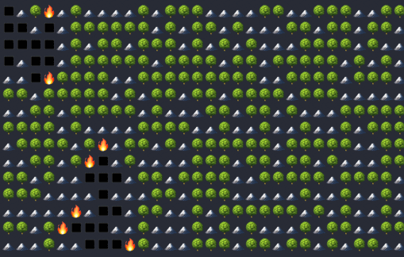

# fire-forest

## EN

A simple and fun introduction to algorithms, extracted from a course in a Professional Bachelor's Degree, based on an idea by [Matthias Lamoureux](mailto:matthias@extrabat.com) from "Chaos and Fractals, New Frontiers of Science" (Peitgen, Jürgens, Saupe).

This project aims to explore basic concepts of algorithms such as conditions, loops, and arrays by simulating a forest fire that spreads in the cardinal directions each loop.

### Instructions: Forest Fires

Simulation of the propagation of a forest fire based on the distribution of trees.

Duplicate the file `template_EN.js` and rename it to index.js.

#### Exercise 1: Fill the Forest with Trees

Write the `fill()` method that fills the forest with trees according to the given probability.

- Note: See the `Math.random()` method for managing the probability.

#### Exercise 2: Ignite the Fire...

Write the `startFire(x, y)` method that ignites the fire at the position x, y only if it contains a tree.

#### Exercise 3: Pyromaniac!

Write the `startRandomFire()` method that randomly ignites a fire at a tree location.

- Note: If there are no more trees, this method does nothing.

#### Exercise 4: Fire Propagation...

Write the `propagation()` method that propagates the fire according to the following rules:

- A burning tree sets its 4-connected neighbors (North, East, South, and West) on fire.
- A burning tree becomes a burnt tree.
- The method returns `false` if there are no more burning trees, true otherwise.

#### Exercise 5: Animate a Fire

- Create a forest.
- Start two fires.
- Animate the fire propagation using the `play()` method.

#### And now?...

This problem illustrates the concept of percolation threshold associated with chaos theory.

By analyzing the proportion of remaining trees after the fire based on the filling probability, there is a threshold beyond which many trees burn. This is called the percolation threshold.

- Test a fire with low probability (0.2) and high probability (0.8) (only one ignition).
- Try to find the percolation threshold of a 50x50 forest.
- Change the propagation to 8-connectedness and find the percolation threshold.
- Change the propagation to diagonal 4-connectedness and find the percolation threshold.
- Investigate the impact of forest size on the percolation threshold.
- Investigate the impact of the number of ignition points on the percolation threshold.
- Read the excellent book "Chaos and Fractals, New Frontiers of Science" (Peitgen, Jürgens, Saupe).

## FR

Simple et fun introduction à l'algorithmie extrait d'un cours de Licence professionnelle sur une idée de [Matthias Lamoureux](mailto:matthias@extrabat.com) d’après "Chaos and Fractals, New Frontiers of Science (Peitgen, Jürgens, Saupe).

Ce projet a pour but d'aborder des concepts simples de l'algorithmie comme les conditions, boucles et tableaux en simulant un feu de forêt qui se propage vers les points cardinaux chaques boucles.

### Consignes: Feux de forêt

Simulation de la propagation d'un feu de forêt en fonction de la répartition des arbres.
Dupliquer le ficher `template_FR.js` et renommer le `index.js`.

#### Exercice 1 : Remplir la forêt d'arbres

Écrire la méthode `fill()` qui remplit la forêt avec des arbres avec la probabilité donnée.

- Note: Voir la méthode `Math.random()` pour gérer la probabilité.

#### Exercice 2 : Allumer le feu...

Écrire la méthode `startFire(x, y)` qui met le feu à la case x,y uniquement si c'est un arbre.

#### Exercice 3 : Pyromane !

Écrire la méthode `startRandomFire()` qui met le feu à une case d'arbre au hasard.

- Note: S'il n'y a plus d'arbre cette méthode ne fait rien.

#### Exercice 4 : Propagation de l'incendie...

Écrire la méthode `propagation()` qui va propager le feu suivant les règles suivantes :

- Un arbre en feu met le feu à ses voisins 4-connexes (Nord, Est, Sud et Ouest)
- Un arbre en feu devient un arbre brûlé
- la méthode renvoie `false` s'il ne reste plus d'arbre en feu, `true` sinon.

#### Exercice 5 : Animer un incendie

- Créer une forêt
- Démarrez deux feux
- Animez la propagation du feu via la méthode `play()`

#### Et maintenant ?...

Ce problème illustre la notion de l'indice de percolation liée à la théorie du chaos.
Si l'on analyse la proportion d'arbres restant après l'incendie en fonction de la probabilité de remplissage, il y a un seuil à partir duquel beaucoup d'arbres brûlent.
C'est l'indice de percolation.

- Tester un incendie avec une probabilité basse (0.2) et haute (0.8) (un seul départ de feu)
- Essayer de trouver l'indice de percolation d'une forêt 50x50
- Passer la propagation en 8-connexité, trouver l'indice de percolation
- Passer la propagation en 4-connexité diagonale, trouver l'indice de percolation
- Chercher l'impact de la taille de la forêt sur l'indice de percolation
- Chercher l'impact du nombre de départs de feu sur l'indice de percolation
- Lisez l'excellent livre "Chaos and Fractals, New Frontiers of Science (Peitgen, Jürgens, Saupe)"
